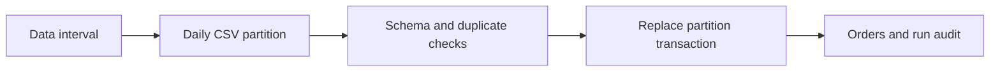

# Airflow Backfill Pipeline

An orders pipeline with deterministic daily partitions, transactional replacement, and an Airflow 3 DAG. It demonstrates the reliability patterns behind my Airflow orchestration experience. All source orders are synthetic.



## Run without Airflow

Python 3.12; no extra dependencies:

```bash
python demo.py --start 2026-01-01 --end 2026-01-02
python -m unittest discover -s tests -v
```

Expected completed revenue: 1200 cents for January 1 and 3000 cents for January 2. Run again; the warehouse still has four orders. Invalid input leaves the old partition intact. A missing date fails rather than being treated as an empty success.

## Airflow adapter

The Dockerfile packages `dags/orders_backfill.py` with Airflow 3.3.2. With Docker installed:

```bash
docker build -t eswar-airflow-demo .
docker run --rm -p 8080:8080 eswar-airflow-demo airflow standalone
```

Read the generated credentials in the container logs, open localhost:8080, and unpause the DAG. Generate daily CSV files before enabling catchup over dates beyond the two sample days; missing partitions deliberately fail. Use Airflow's run/backfill interface to select a small interval. `airflow standalone` is a local development setup and container state is ephemeral.

## Reliability choices

- DAG input is `data_interval_start`; historical jobs do not accidentally load today's partition.
- Two task retries are configured in the DAG. Core function tests verify rerun safety and failure behavior; local tests do not execute the scheduler's retry mechanism.
- One active DAG run avoids concurrent SQLite writers. Production distributed workers need a shared warehouse, not this local database file.
- Money uses integer cents. Cancelled orders are retained but excluded from completed revenue.
- The local backfill commits each day independently. A later failure preserves earlier days; rerun the same interval after fixing the source.

Verification: local processing and failure tests are runnable and checked. The Docker image and Airflow scheduler require Docker and have not been executed in the Windows build environment.

References: [Official Airflow Docker guidance](https://airflow.apache.org/docs/apache-airflow/stable/howto/docker-compose/index.html).
